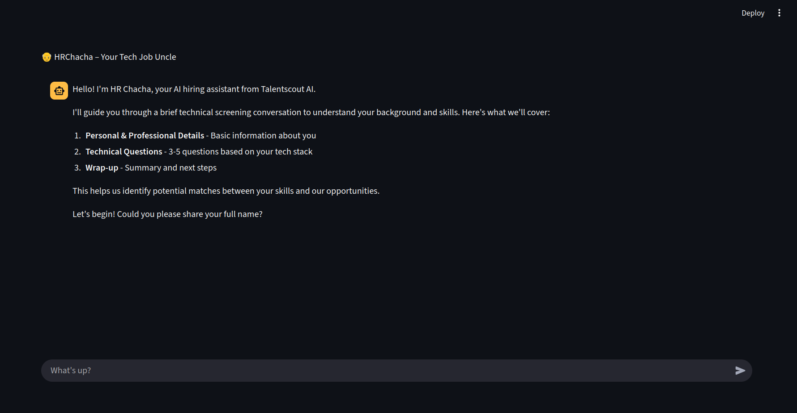
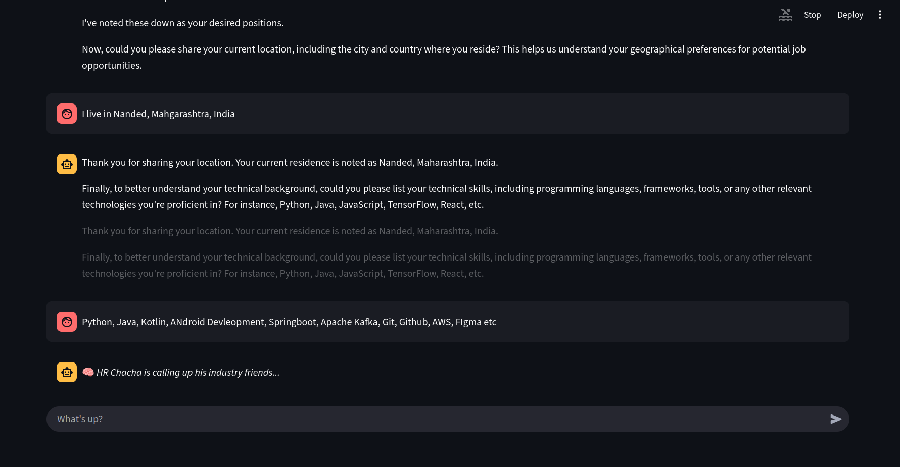
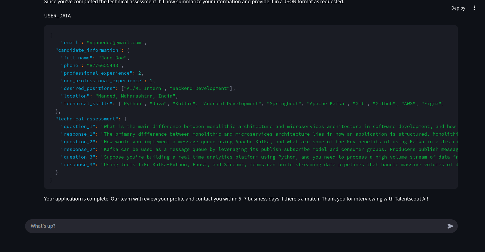
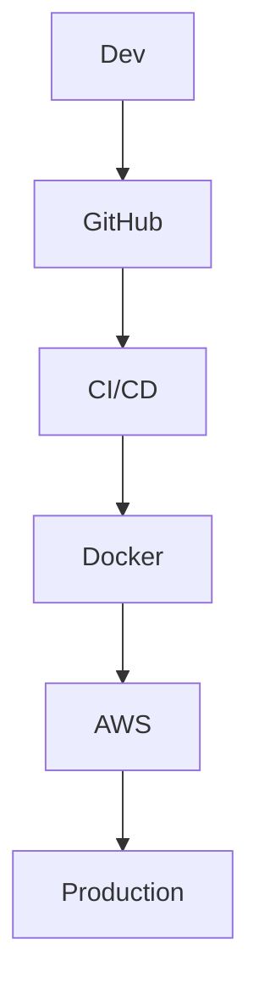

# 🤖 HRChacha: AI-Powered Hiring Assistant

&#x20;  &#x20;

> **HR Chacha** is an AI-powered hiring assistant chatbot built using **Streamlit**, **LLaMA 3.3 70B**, **MongoDB** and deployed with **AWS ECR + EC2**. It simulates an intelligent recruiter that collects candidate details, asks technical questions based on their skills, and formats their data into a clean JSON format for HR/admins to evaluate.

Live link: (AWS Live Deployment Paused) Streamlit -> https://hrchacha-bmerkgxmqzeiwvlkvjccwt.streamlit.app//
---

## 📌 Project Overview

**HR Chacha** is a conversational AI assistant built for recruitment automation. It:

* Greets candidates professionally
* Collects basic candidate info (name, email, experience, location, tech stack)
* Dynamically generates tech-specific questions (e.g., Python, Django)
* Accepts candidate answers, stores data in MongoDB
* Outputs final structured data for HR teams to assess

---
## Screenshots



___


## 🚀 Installation Instructions

### 1. Clone the repo

```bash
git clone https://github.com/Shristirajpoot/HRChacha.git

cd HRChacha
```

### 2. Setup environment

```bash
python -m venv venv
source venv/bin/activate  # Windows: venv\Scripts\activate
pip install -r requirements.txt
```

### 3. Environment Variables

Create a `.env` file:

```env
MONGO_URI=mongodb+srv://<user>:<pass>@cluster.mongodb.net/
TOGETHER_API_KEY=your_together_api_key_here
```

### 4. Run the app

```bash
streamlit run app.py
```

---

## 📖 Usage Guide

1. Open your browser to `http://localhost:8501`
2. Start chatting! HR Chacha will ask for your name, email, experience, and skills
3. Based on your tech stack, HR Chacha will generate 3-5 relevant questions
4. Once all answers are received, your structured JSON will be shown and saved to MongoDB

---

## ⚙️ Technical Details

### 🧱 Tech Stack

* **Frontend**: Streamlit
* **Backend**: Python
* **LLM API**: Together AI (LLaMA 3.3 70B Instruct Turbo)
* **Database**: MongoDB Atlas
* **Deploymet**: Github Workflow, Runners, Docker,  AWS ECR, AWS EC2
* **Prompt Management**: Custom, static system prompt with extract logic

### 📦 Libraries Used

* `streamlit`
* `pymongo`
* `python-dotenv`
* `together` (for API access to LLaMA)

### 🧠 LLM Architecture

* Uses chat history and a persistent `system` role
* Messages streamed with cursor-style output
* Structured prompt instructs LLM to collect & serialize user data

---

## 🎯 Prompt Design

Prompting strategy follows best practices:

* Starts with a clear role definition
* Instructionally structured in numbered format
* Uses trigger phrase `USER_DATA` to tag final JSON output
* Prompts candidate to answer tech questions with number and answer pairing
* Handles irrelevant input with fallback behavior

> See the full prompt in [`hrchacha/prompts`](./hrchacha/prompts/__init__.py)

---


## 📦 CI/CD & Deployment

* **Docker**: for containerized development and deployment
* **GitHub Actions**: to automate test and deployment workflows
* **AWS EC2 / ECR**: for cloud hosting + storing image



---

## 👨‍💻 Author

* 👤 **Shristi Rajpoot**
 Pre-Final Year IT | ML + Fullstack | Building real-world solutions
